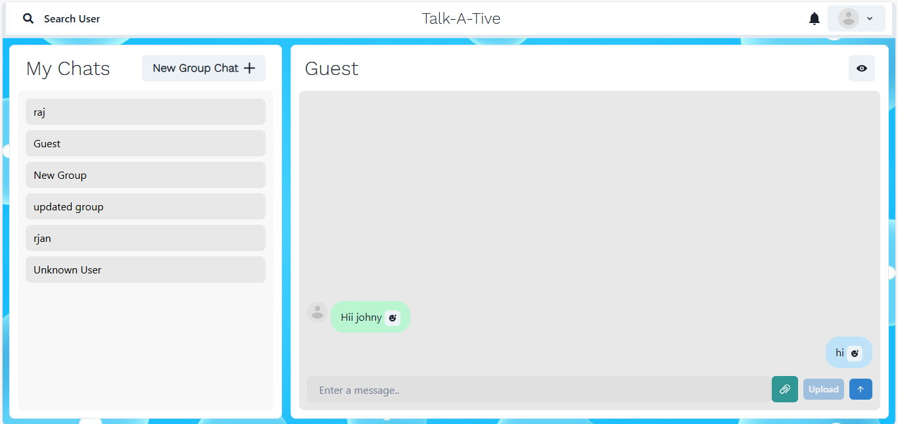
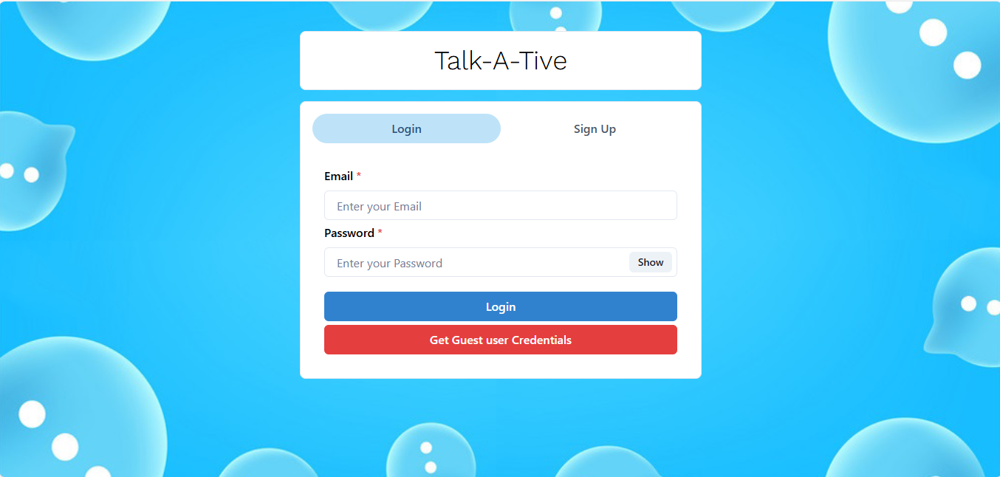
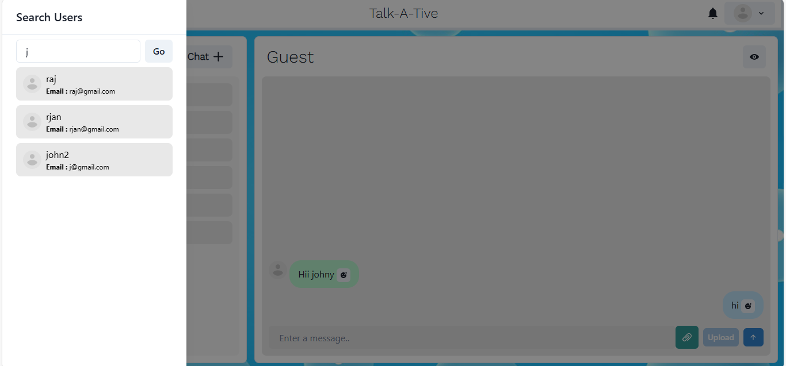
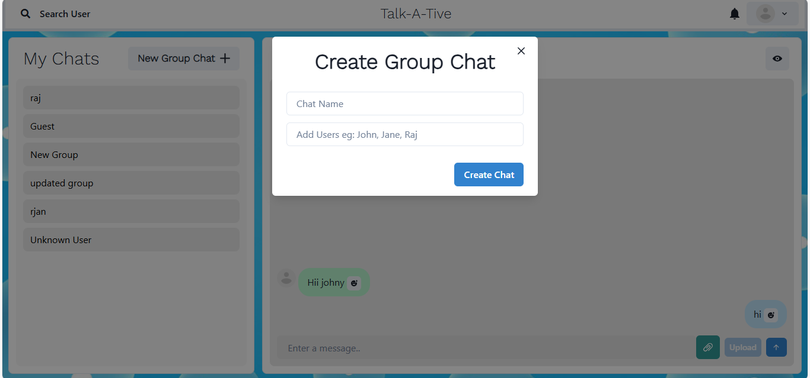
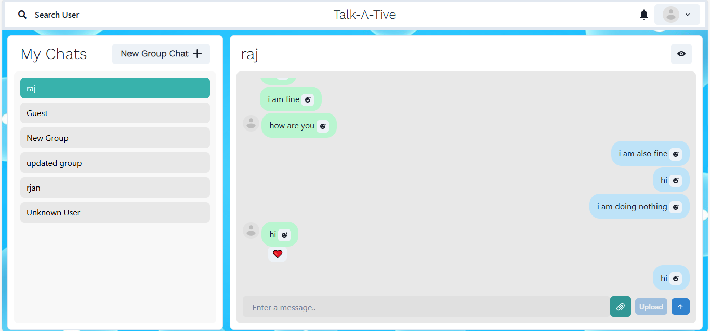

# 💬 Chit-Chat App — Real-Time Messaging Application

## 📌 Project Overview

**Chit-Chat App** is a real-time messaging web application that allows users to send and receive messages instantly. It features user authentication, private chats, and real-time communication using WebSockets.

Users can register, login, connect with others, and have seamless conversations in real time. The app is built with a modern full-stack architecture to deliver a smooth chatting experience.

This project demonstrates:
- Real-time communication using Socket.IO
- Authentication & protected routes
- Clean frontend UI with dynamic updates
- Scalable backend with REST APIs and WebSockets

---

## 🌐 Live Demo

Frontend: [https://chit-chat-app-q7xh.onrender.com](https://chit-chat-app-q7xh.onrender.com)  
Backend: [https://chit-chat-app-x8xy.onrender.com](https://chit-chat-app-x8xy.onrender.com)

---

<!-- ## 📸 Screenshots

### 🏠 Home Page


### 🔐 Login Page


### 🛒 Cart Page


### 🧾 My Orders Page


--- -->

## 📸 Screenshots

<table>
<tr>
<td width="50%">
<h4 align="center">🏠 Home Page</h4>

</td>
<td width="50%">
<h4 align="center">🔐 Login Page</h4>

</td>
</tr>

<tr>
<td width="50%">
<h4 align="center">🔎 User Search</h4>

</td>
<td width="50%">
<h4 align="center">👥 Group Chat</h4>

</td>
</tr>

<tr>
<td width="50%">
<h4 align="center">💬 One-to-One Chat</h4>

</td>
</tr>
</table>

---

## 🛠️ Tech Stack

### 🖥️ Frontend (User Interface)

- ⚛️ React (Create React App)
- 🎨 Chakra UI (Component Library)
- 🎭 Framer Motion (Animations)
- 🔄 React Router DOM
- 🎯 React Icons
- 📦 Axios
- 💬 Socket.IO Client (Real-time messaging)
- 😀 Emoji Picker React
- 🔔 React Toastify (toast notifications)

### 🛠️ Backend (Server)

- 🟢 Node.js
- 🚀 Express.js
- 🗃️ MongoDB (via Mongoose)
- 🌐 Socket.IO (Real-time messaging)
- 📤 Multer (file upload)
<!-- - ☁️ Cloudinary (image hosting)
- 📤 Multer + Streamifier (file upload & streaming to Cloudinary) -->
- 🔐 JWT Authentication 
- 🧂  Bcrypt for password hashing 
- 📦 dotenv for environment configuration
- 🧪 CORS for logging and API support

---

## 📁 Folder Structure

```
Chit-Chat-App/
├── frontend/               # Frontend (React)
│   ├── public/
│   ├── src/
|   |   ├── assets/         # Images, icons, etc.
|   |   ├── animations/     # Lottie & animation files
│   │   ├── components/     # Reusable components (Navbar, Chat, Profile, etc.)
│   │   ├── pages/          # Page-level components (Home, Chat)
│   │   ├── config/         # Utility & helper functions
|   |   ├── context/        # Global state management
│   │   ├── App.jsx         # Main app structure
│   │   └── index.jsx       # App entry point
│   └── package.json
│
├── backend/                # Backend (Node + Express)
│   ├── config/             # DB connection, environment setup
│   ├── controllers/        # Business logic
│   ├── models/             # Mongoose schemas (User, Chat, Message, etc.)
│   ├── routes/             # Express routes (User, Chat, Message, etc.)
│   ├── middleware/         # Error handling, auth
│   ├── server.js           # Entry point
│   └── package.json
│
└── README.md
````
---

## 🚀 Getting Started

### Prerequisites

- Node.js 20.x
- MongoDB Atlas/local
- Git

---

## ⚙️ Installation & Setup

#### 1 Clone the repo

```bash
https://github.com/SC1709/Chit-Chat-App.git
cd Chit-Chat-App
````

### 🖥️ Frontend (Client)

```bash
cd frontend
npm install
# Create .env file (see below) and set the following:
npm run dev
````

### 🛠️ Backend (Server)

```bash
cd ../backend
npm install
# Create .env file (see below) and set the following:
npm start
```

---

## 🔐 Environment Variables

Create a `.env` file in `frontend/` directory:

```
REACT_APP_API_URL=http://localhost:5000
```

Create a `.env` file in `backend/` directory:

```
PORT=5000
MONGO_URL=your_mongodb_connection_url
JWT_SECRET=your_jwt_secret
FRONTEND_URL=http://localhost:3000
```
<!-- CLOUDINARY_CLOUD_NAME=your_cloud_name
CLOUDINARY_API_KEY=your_api_key
CLOUDINARY_API_SECRET=your_api_secret -->

---

## 🚀 Features

* 🎨 Fully responsive UI
* 🧭 Client-side routing with React Router
* 📡 API Integration with Express backend   
* 📦 MongoDB schema design for user,chat,etc.
* 🔐 User Authentication (JWT, bcrypt)
* 💬 Real-time Messaging using Socket.IO
* 🔔 Push Notifications for New Messages
* 🖼️ Image & File Sharing in chat
* 👥 Group Chats with Multiple Participants
* 👤 One-to-One Private Chats
* 😀 Emoji Support in messages
* 📜 Message History Persistence
* ⚡ Instant Message Delivery

---

## 🔮 Future Enhancements

* 📞 Audio & Video Calling
* 🟢 Online / Offline User Status Indicator
* 📌 Pin Important Messages
* 🔐 Two-Factor Authentication (2FA)
* 📂 Cloud Storage Integration (AWS / Firebase)
* 📱  Mobile App Version (React Native)
* 📊 Chat Analytics Dashboard
* 📧 Email Verification System

---

### 📦 API Endpoints

#### 👤 User Routes

| Method | Endpoint              | Description                  | Access     |
|--------|-----------------------|------------------------------|------------|
| POST   | `/api/user/register`  | Register new user            | Public     |
| POST   | `/api/user/login`     | Login user & get JWT         | Public     |
| GET    | `/api/user`           | Search users                 | Private    |

#### 💬 Chat Routes

| Method | Endpoint               | Description                  | Access     |
|--------|------------------------|------------------------------|------------|
| POST   | `/api/chat`            | Create one to one chat       | Private    |
| GET    | `/api/chat/fetchChats` | Fetch logged in users chats  | Private    |
| POST   | `/api/chat/group`      | Create group chat            | Private    |
| PUT    | `/api/chat/rename`     | Rename group chat            | Private    |
| PUT    | `/api/chat/groupadd`   | Add user to group            | Private    |
| PUT    | `/api/chat/groupremove`| Remove user from group       | Private    |

#### 📨 Message Routes

| Method | Endpoint                       | Description                | Access     |
|--------|--------------------------------|----------------------------|------------|
| POST   | `/api/message`                 | Send new message           | Private    |
| GET    | `/api/message/:chatId`         | Get all messages of a chat | Private    |
| DELETE | `/api/message/:messageId`      | Delete a message           | Private    |
| POST   | `/api/message/upload`          | Upload file/image message  | Private    |
| PUT    | `/api/message/:messageId/react`| React to a message (emoji) | Private    |

Real-time messaging is handled using Socket.IO, not REST APIs.

---

### 🤝 Contributing

We welcome contributions from developers of all experience levels! Help us improve **Chit Chat App** by fixing bugs, adding features, or refining the UI/UX.

#### 🔧 How to Contribute

1. **Fork** the repository
2. **Clone** your fork:
   ```bash
   git clone https://github.com/your-username/Chit-Chat-App.git
   make specific changes 
3. **Create** a new branch:
    ```bash
    git checkout -b feature/your-feature-name
4. **Make** your changes (frontend, backend)
5. **Commit** and **push**:
    ```bash
    git add .
    git commit -m "Add: your feature"
    git push origin feature/your-feature-name
6.  Open a **Pull** Request (PR) with a clear description

🧰 Contribution Tips
1. Follow existing code styles
2. Test your changes before pushing
3. Link related issues if applicable
4. Keep PRs focused and small
---

## 📃 License

This project is licensed under the MIT License - see the [LICENSE](LICENSE) file for details.

---

## 👨‍💻 Developed & Maintained by

**Sachin Choudhary**
• [🐙 GitHub](https://github.com/SC1709) • [🔗 LinkedIn](https://linkedin.com/in/sachin-choudhary)

> *“Connecting people instantly through real-time communication.”*
